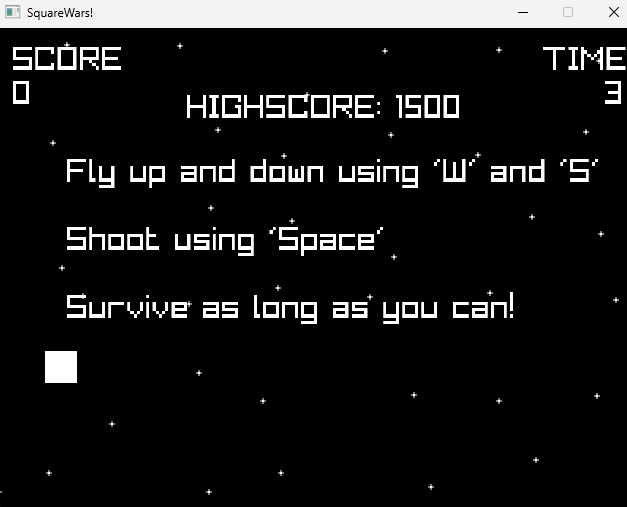

# SquareWars

I have heard alot of talk about the Zig programming language and I wanted to try it out.
No better way than to implement a game using the language.
So that is what I did in this repro.

The game is a simple 2D shooter set in space:

Technical notes on the game:
* `Thing` struct represents bullets and squares, things have function pointers allowing specialized behavor
* `Arena` generic struct storing elements that are indexed / referenced using generational keys, making referencing easier and less error-prone, e.g no need to null references in case of deletion of an element
* `Vec2` struct is a partial 2D vector implementation
* `Highscore` struct stores the highscore and is persisted to and from highscore.json
* `Rect` struct provides simple collision detection
* `Platform` struct provides an Interface implemented using a v-table that abstracts away from the underlying platform, in this case the platform instance is `Raylib`
* `Game` game loop and overall game logic
* Uses `Raylib`

Thoughts on Zig after this small project:
* Zig feels like a more modern C with generics and without the macro madness. 
* Comptime is super awesome, I find the thought of 'types' as values really great. I needed a few days to adjust my mental model that types, such as my `Arena`, was actually a function returning a new typed struct type depending on the comptime type argument.  
* Zig feels low level, specifically: no operator overloading, manual allocation, de-allocation using defer and without the possibility to use smart pointers. While I understand the argument for these decisions: to avoid hidden control flow, I miss these features.
* Zig lacks language support for interfaces. Interfaces have to be implemented by hand by handcoding a v-table.  

